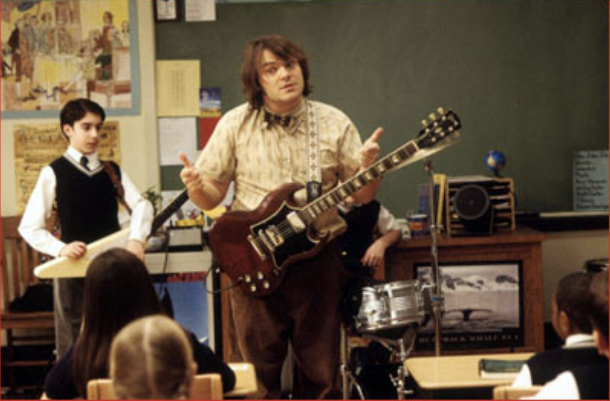
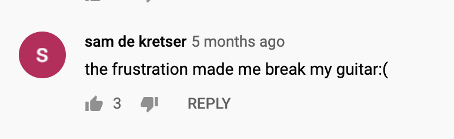
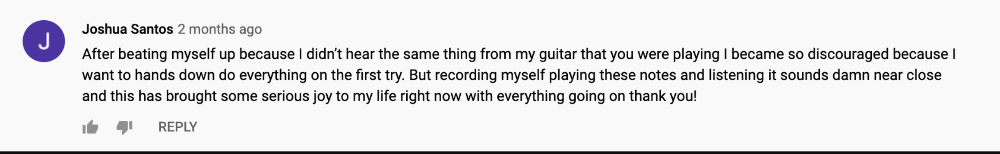
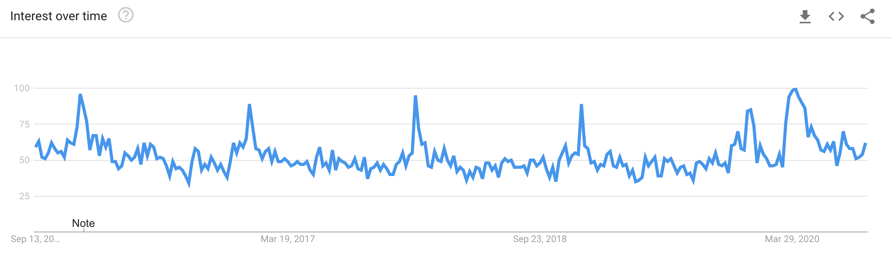

<style type="text/css">
.main-container {
  max-width: 600px;
  margin-left: auto;
  margin-right: auto;
}
</style>

<style>
p.caption {
  font-size: .7em;
}
</style>


<h1>The (online) School of Rock</h1>

By Katherine Wilson


```{r, out.width=400, echo=F}

```

<div style="margin-bottom:50px;">
</div>
How is your quarantine hobby going? For many of those stuck at home over these months, the extra time has been an excuse to return to that <a href= "https://www.vice.com/en_us/article/y3zg8y/hobbies-to-try-during-quarantine-how-it-worked-out"  target = "_blank"> calligraphy hobby </a> we gave up on in college, or try up something entirely new <a href = "https://www.youtube.com/watch?v=avOUFvrmNfQ"  target = "_blank">(napkin folding?) </a>

One of the hobby businesses that has grown in the pandemic recession over the last few months? Guitars Companies like Fender and Gibson are seeing <a href = "https://www.nytimes.com/2020/09/08/style/guitar-sales-fender-gibson.html"  target = "_blank"> growth in sales of guitars </a> like never before. Andy Mooney, CEO of Fender suggests that this "will be the biggest year of sales in history". With the excitement over guitars comes an important consideration: how to actually play it. 

Of course we all wish we had <a href = "https://www.youtube.com/watch?v=ZoZBI52KmDo"target = "_blank">Jack Black </a> as our substitute rock teacher, but in the mean time, many people have turned to the global classroom: YouTube. With thousands of videos on guitar, our inspired rockers have hours of instructional content at their fingertips: videos ranging from music theory to scale development to a three part lesson of <a href = "https://www.youtube.com/watch?v=1ftNauLjorY"target = "_blank">the Stairway to Heaven lead part </a>. The top teachers gross over 2 million subscribers and more than 1,000 videos to date.

Don't confuse more content or accessibility with making something "easier" to learn, though. Even with the right focus, skills, and support, sticking with any instrument is hard, especially guitar. Jimi Hendrix once said that “sometimes you'll want to give up on the guitar, you'll hate the guitar”. The six string is a notoriously difficult instrument to learn, with unnatural strumming patterns and a non-intuititive fretboard. Doesn't help that we also watch thousands of hours of guitarists on YouTube who have seemingly <a href = "https://www.youtube.com/user/nprmusic"target = "_blank">mastered </a> the instrument.

But Hendrix also said, “...if you stick with it, you’re gonna be rewarded”. If we better understand these online learners, we hope to be reward too: the next Paul McArtney or Bonnie Raitt is making the most of their quarantine time right now. So we looked at over 4,000 comments from 100 videos on YouTube of the most popular instructional guitar channels, <a href="https://www.youtube.com/channel/UCmnlTWVJysjWPFiZhQ5uudg" target = "_blank">Marty Shwartz</a>, <a href="https://www.youtube.com/user/JustinSandercoe" target = "_blank">Justin Guitar</a>, and <a href="https://www.youtube.com/user/andycrowley" target = "_blank">Andy Guitar</a>.


```{r, out.width=400, echo=F}

```

<div style="margin-bottom:50px;">
</div>
<h2>Is it too hard? Or not hard enough? </h2>

The <a href="https://en.wikipedia.org/wiki/Zone_of_proximal_development/" target = "_blank">Zone of Proximal Development</a>, coined by educational psychologist Lev Vygotsky, refers to that sweet spot of instruction between something being too easy and too hard. Think of the moment right before a parent takes their hand off of the back of a child's bike for the first time. In the space between completing a task without the assistance of the teacher or parent or peer, and completing the task independently, true learning occurs. 

Teachers already know this, and place students in targeted, differentiated instruction groups all the time. YouTube teachers, on the other hand, are in the business of making content for a broad audience. While they often do their best to curate an ordered playlists, or group videos by skill level, the choice is really the student's to monitor their own learning, and to find that sweet spot between too hard and too easy.

Teachers also know that "this is not in the Zone of my Proximal Development" is not usually what students realistically say when judging their own learning performance. Instead, the realization may sound like "this is too hard" or "this is too easy". So, we matched the sentiment of video comments with the popular NLP library, <a href="http://www2.imm.dtu.dk/pubdb/edoc/imm6006.pdf" target = "_blank">AFINN</a>, which assigns words on a -5 to 5 scale, with 4 being the most positive comments, and -4 being the most negative.


```{r echo=FALSE, message=FALSE, warning=FALSE, plot.width=400}
load("comments_small.Rdata")
load("unnested_small.Rdata")
library(tidyverse)
library(tidytext)
load("nrc.Rdata")
hard_easy_data <- read.csv("data/hard_easy_data.csv")
hard_easy_data <- hard_easy_data %>%
  unnest_tokens(word, textOriginal)
hard_easy_data <- hard_easy_data %>%
  inner_join(get_sentiments("afinn")) %>%
  group_by(X) %>%
  mutate(means = mean(value))
match <- read.csv("data/hard_easy_data.csv")
joined <- merge(match, hard_easy_data, by = "X")

super_both <- joined %>%
  select(textOriginal, hard_marker.x, easy_marker.x, word, value, means) %>%
  mutate(nums = sapply(strsplit(textOriginal, " "), length)) %>%
  mutate(cureword = case_when(
    str_detect(textOriginal, "fuck") |
      str_detect(textOriginal, "bitch") ~ 1)) %>%
  mutate(thanks = case_when(
    str_detect(textOriginal, "thank you") |
      str_detect(textOriginal, "thanks") ~ 1)) %>%
  mutate(laughing = case_when(
    str_detect(textOriginal, "haha") |
      str_detect(textOriginal, "lol") ~ 1)) %>%
  mutate(Marty = case_when(
    str_detect(textOriginal, "Marty") |
      str_detect(textOriginal, "Schwartz") ~ 1)) %>%
  group_by(textOriginal) %>%
  mutate(comment_length = mean(nums), sentiment_score = mean(value)) %>%
  mutate(polarity_identifier = ifelse(sentiment_score >0, "positive", "negative")) %>%
  mutate(factor_sentiment = round(sentiment_score, digits = 0))%>%
  mutate(pentatonic = case_when(str_detect(textOriginal, "pentatonic") ~ 1)) %>%
  mutate(scales = case_when(str_detect(textOriginal, "scales") ~ 1)) %>%
  mutate(total_specifics = pentatonic + scales) %>%
  mutate(curse_word = case_when(
    str_detect(textOriginal, "fuck") |
      str_detect(textOriginal, "bitch") ~ 1)) %>%
  mutate(Marty = case_when(
    str_detect(textOriginal, "Marty") |
      str_detect(textOriginal, "Schwartz") ~ 1))%>%
  mutate(lists_any_technical_skill = case_when(
    str_detect(textOriginal, "pentatonic") |
      str_detect(textOriginal, "scales") |
      str_detect(textOriginal, "fret") |
      str_detect(textOriginal, "fretboard")|
      str_detect(textOriginal, "theory") |
      str_detect(textOriginal, "scale")~ 1)) %>%
  mutate(lists_any_technical_skill = ifelse(is.na(lists_any_technical_skill), 0, 1)) %>%
  mutate(scales = ifelse(is.na(scales), 0, 1)) %>%
  mutate(thanks = ifelse(is.na(thanks), 0, 1)) %>%
  mutate(pentatonic = ifelse(is.na(pentatonic), 0, 1)) %>%
  mutate(laughing = ifelse(is.na(laughing), 0, 1)) %>%
mutate(hard_word = ifelse(is.na(hard_marker.x), 0, 1))%>%
  mutate(Marty = ifelse(is.na(Marty), 0, 1)) %>%
  mutate(curse_word = ifelse(is.na(curse_word), 0, 1))%>%
  select(textOriginal, comment_length, polarity_identifier, pentatonic, scales,
         hard_word, word, value, curse_word, Marty, thanks, laughing, factor_sentiment, lists_any_technical_skill)
super_both$polarity_identifier <- as.factor(super_both$polarity_identifier)
super_both_comment_level_hard <- super_both %>%
  group_by(textOriginal, factor_sentiment, hard_word) %>%
  summarise(length = mean(comment_length))
super_both_comment_level_hard$hard_word <- as.factor(super_both_comment_level_hard$hard_word)
p1 <- ggplot(data = super_both_comment_level_hard, aes(x=factor_sentiment,
                                                      y = length)) +
  geom_jitter(aes(x=factor_sentiment,
                  y = length, color = hard_word), alpha = .3, size = 2) +
  ylim(0,100)+
  scale_color_manual(values = c("#A9D0F5", "#9F81F7"),
                     name = "This",
                     labels = c("No mention of difficulty", "Mentions difficulty")) +
  theme(panel.grid.major = element_blank(),
        panel.grid.minor = element_blank(),
        panel.background = element_blank(),
        axis.ticks = element_blank(),
        legend.title = element_blank())+
  xlab("Sentiment Score" ) +
  ylab("Comment Length") +
  scale_x_discrete(limits = c(-1,-2,-3,-4,1,2,3, 0, 4)) +
  labs(caption = "Distribution of student comments by length and sentiment grouping")
p1

```
Positive comments are more prevalent, and especially clustered around 15 to 25 words. Longer comments, when positive, are more likely to include the word "hard" than shorter, positive comments. Take these two comments, both of which scored 3 for high positivity. The comments that are longer, but more positive and mentioned hard seem to “rationalize” the hardness in some way, hence all of the extra words. In the longer comment, the student is referencing the difficulty, but in the shorter version, they praise the teacher.

More than just having the right content, it is also what the learner thinks about themselves. Another psychologist, Albert Bandura, coined the term <a href="https://en.wikipedia.org/wiki/Self-efficacy" target = "_blank">self-efficacy</a>. to refer to a belief in one's abilities. Think of this as the "I think I can". But recent work in educational psychology has connected this simple belief to the specific “interpretation of difficulty” within a situation. When we encounter hard things, is that a sign that we are learning, or that we should give up the guitar and choose something else?

Teachers know this, which is why they scaffold learning and take students through the complexity very slowly. But for a student to recognize their own difficulty, and continually push themselves, is a different story.

<div style="margin-width:900px;">

```{r, out.width=900, echo=F}

```
</div>


And that takes us to thinking about the other side of the spectrum, students who had negative sentiment scores. These students are less wordy overall, and also less likely to mention the word hard as they get more negative. So these strong negative comments, what words are most likely to appear? Maybe we need to look at more words than just "hard".

<div style="margin-bottom:50px;">
</div>

<h2>Today's Lesson</h2>

The graph shows the liklihood of each group expressing words in the group. Those shorter comments towards the left hand side? They have a strong liklihood that the comment contains cursing. Laughter, on the other hand, is more likely to appear in our high sentiment groups. 

```{r echo=FALSE, message=FALSE, warning=FALSE}
library(kableExtra)
## with all factors
library(scales)
freqs_factor <- super_both %>%
  select(textOriginal, pentatonic, scales, hard_word, factor_sentiment,
         curse_word, Marty, thanks, laughing) %>%
  distinct() %>%
  group_by(factor_sentiment) %>%
  mutate(n = n()) %>%
  summarise(Pentatonic = sum(pentatonic)/n,
            Hard = sum(hard_word)/n,
            Scales = sum(scales)/n,
            Curse = sum(curse_word)/n,
            Marty= sum(Marty)/n,
            ThankYou= sum(thanks)/n,
            Laughter= sum(laughing)/n) %>%
  distinct()
try_factor <- gather(freqs_factor, 'Liklihood of Mentioning', meas, Pentatonic:Laughter) %>%
  spread(factor_sentiment, meas) 
try_factor$`1`<- percent(try_factor$`1`)
try_factor$`2`<- percent(try_factor$`2`)
try_factor$`3`<- percent(try_factor$`3`)
try_factor$`4`<- percent(try_factor$`4`)
try_factor$`-1`<- percent(try_factor$`-1`)
try_factor$`-2`<- percent(try_factor$`-2`)
try_factor$`-3`<- percent(try_factor$`-3`)
try_factor$`-4`<- percent(try_factor$`-4`)
try_factor$`0`<- percent(try_factor$`0`)
try_factor <- column_to_rownames(try_factor, 'Liklihood of Mentioning')
knitr::kable(try_factor, booktabs = T, escape = F,caption= "Liklihood of mentioning specific words for each sentiment grouping.") %>%
  kable_paper("striped", full_width = F) %>%
  row_spec(c(1,3,5,7), background = "#E6E6FA") %>%
   row_spec(c(2,4,6), background = "#D8BFD8") %>%
  row_spec(c(0), background = "#B0C4DE", bold = T) %>%
  column_spec(1,background = "#B0C4DE", bold = T)
```


Which brings us to the teacher's pet. Although virtual, love for the teacher can still be expressed. The liklihood of mentioning Marty's name, is five times that for students in the positive 1 group than the negative 1 group. The small percentage that do mention a teacher's name in a strongly negative sentiment are likely to do so with a curse word.

Skill development is of particular interest here. Notice the low probability of mentioning anything about the pentatonics of scales for students with negative comments. This suggests another learning theory "it's hard to know what you know and what you don't know". Identifying words, or gaps, is important, and a source of frustration for new learners is simply not having the vocabulary to express what it is you still need to learn.

At least for the foreseeable future, online learning communities are here to stay. Of course, nothing will ever truly replace the brick and mortar classroom, or the work of a human teacher. But in the time in between, understanding the interactions between people in these communities will certainly lead to better learning outcomes in the long run.


```{r, out.width=600, echo=F, fig.cap= "Google Trend search for 'learn guitar' peaks every year over the holiday season. This March, the search reached and retained its holiday level from a few months before."}

```


In his book, <a href="https://books.google.com/books/about/The_One_World_Schoolhouse_Education_Reim.html?id=wEGftEMW1bgC&source=kp_book_description" target = "_blank">"One World Schoolhouse: Education Reimagined"</a>, Sal Khan, creater of the large online community Khan Academy, details the power and innovation that online school communities can have. He writes about this desire of the learner to continue and find more. The school never closes:

<i>“Can you imagine if someone told Einstein, Okay, wrap up this relativity thing, we’re moving on to European history? Or said to Michelangelo, Time’s up for the ceiling, now go paint the walls. Yet versions of this snuffing out of creativity and boundary-stretching thought happen all the time in conventional schools.”</i>

We hope our future Patti Smiths and John Bonhams are taking advantage of this vast instructional content, and monitoring their own learning in the process. Of course, just like a live stream concert will never replace an in person experience, a YouTube lesson will never replace direct instruction. However, there is something to be said for figuring it out on your own, or, rather, alongside a thousand other classmates from around the world.


<div style="margin-bottom:50px;">
</div>


<h2>Note to reader</h2>

This is a draft of a pitch for a data journalism essay to FiveThirtyEight. If the piece were to be accepted, I would increase the number of videos, edit the narrative, and share code/data with FiveThirtyEight.

About me: I am second year PhD student in Quantitative Methods at Penn, and play guitar in a band on the side. Happy to share my portfolio of other data visualization essays with you, such as one I am working on with The Pudding at the moment.
